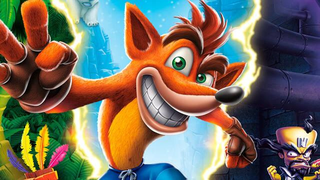
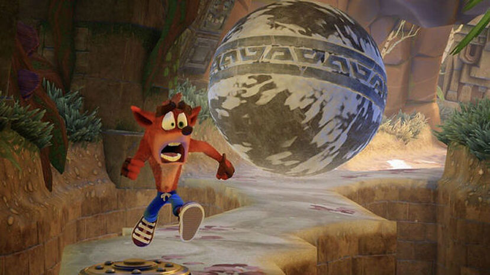

# Geeks-Hubs-Proyecto Consola videojuego

<em> Bienvenido al proyecto Consola video juego de GeeksHubs Academy</em>

### Datos generales

**- Autor del proyecto:** Maria Isabel Rico Almanza.
**- Título del proyecto:** Consola Gameboy. Este es un proyecto con herramientas HTML, CSS, Javascript vanilla, Flexbox y Responsive design.

  
Tabla de Contenidos 

  <ol>
  <li><a href="#objetivo-🎯">Objetivo</a></li>
  <li><a href="#sobre-el-proyecto-🔎">Sobre el proyecto</a></li>
  <li><a href="#deploy-🚀">Deploy</a></li>
  <li><a href="#vistas">Vistas</a></li>
 <li><a href="#licencia">Licencia</a></li>
 <li><a href="#contacto">Contacto</a></li>
  </ol>

## Objetivo 🎯

Este proyecto requería del uso de lenguajes DEV ⚒️ tales como javascript vanilla, CSS y maquetar la consola con HTML.

## Sobre-el-proyecto-🔎

He utliizado unos cuantos contenedores div para clonar la consola Game Boy también he incluido tres imagenes que van cambiando. Al dar click en el boton de reset la imagen vuelve al inicio. Estoy incluyendo un README y la subida a producción con Github pages.

## Deploy 🚀

<a href="https://maricode-40.github.io/Proyecto-Consola/  ">Url a producción</a>

## Vistas

A replicar

Al iniciar el juego

Segunda imagen

Tercera imagen

## Licencia

Este proyecto se encuentra bajo licencia de "Mi Nombre"

## Contacto

